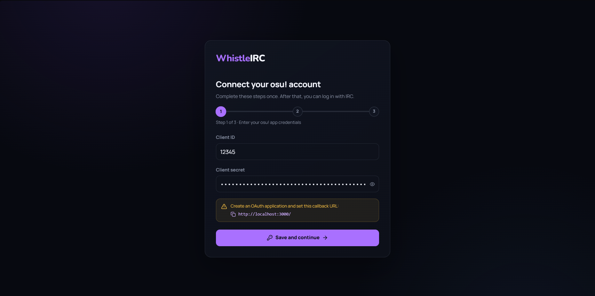
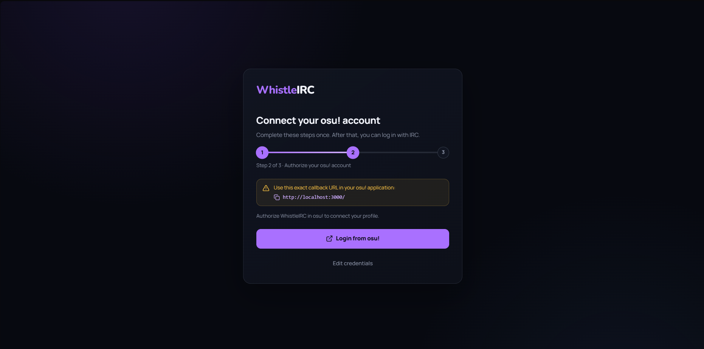
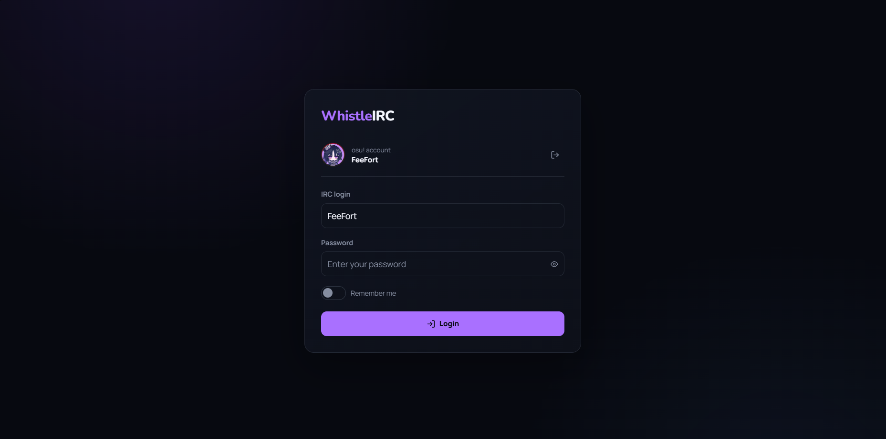
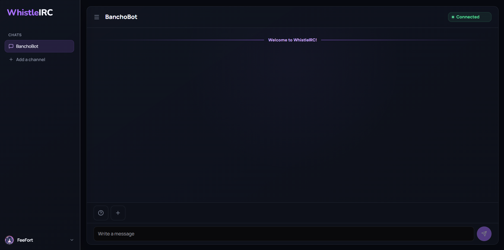
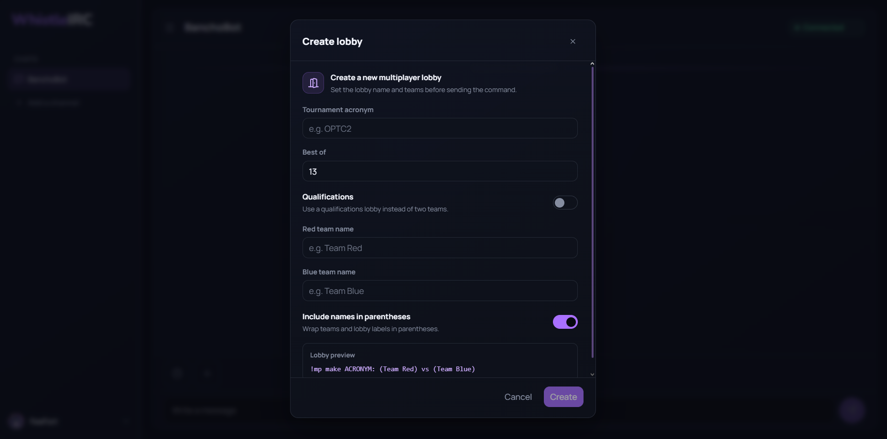
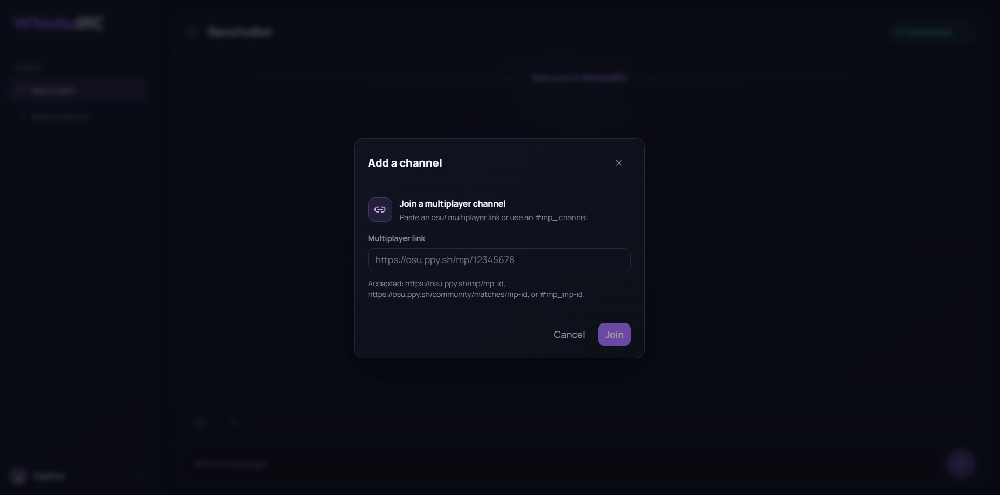
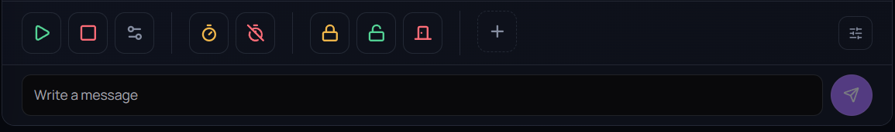
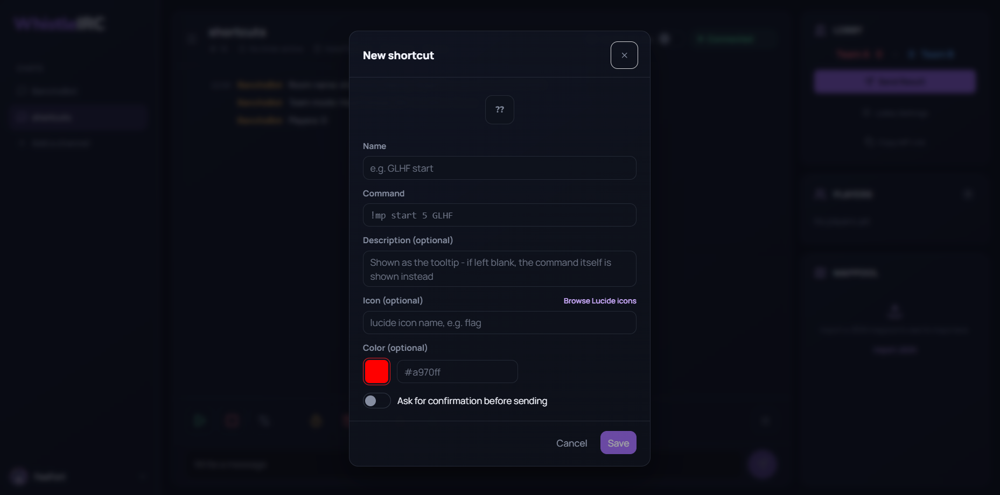
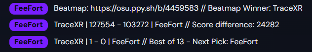
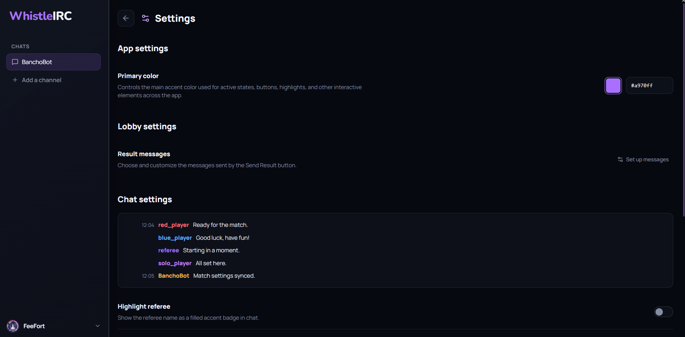

<div align="center">


</div>

WhistleIRC is an IRC client designed specifically for osu! tournament referees who want all their tools in one place.

It connects to osu!bancho IRC and gives you the things you actually need during a match: custom shortcuts, lobby controls, score tracking, automatic result messages, timers, and more. It works whether you create the lobby yourself or join one that is already running.

## Features

- Join an existing multiplayer lobby or create a new one.
- Use built-in referee shortcuts and make your own.
- Keep track of team scores and match progress.
- Calculate match results and send updates to chat automatically.
- Manage players, teams, maps, mods, timers, and lobby settings.
- Customize the theme, accent color, nickname colors, timestamps, and chat behavior.
- Save your settings locally so you do not have to set everything up again next time.

## First-time setup

### 1. Add your osu! app credentials

Open your [osu! account settings](https://osu.ppy.sh/home/account/edit#oauth) and create an OAuth application. Name of the application is not mportant, but if you're unsure what to put in there, you can use `WhistleIRC`.

Copy the application's **Client ID** and **Client Secret** into WhistleIRC. They are saved only in your browser's local IndexedDB storage together with the rest of the saved WhistleIRC authorization data.

osu! will also ask for a callback URL. Use the exact address shown in WhistleIRC's yellow notice:

`http://localhost:3000/`

You can click the address to copy it. WhistleIRC will show a small confirmation toast when it is copied.



Click **Save and continue** once both fields are filled in.

### 2. Log in from osu!

Check the callback URL and click **Login from osu!**. A new page on `osu.ppy.sh` will open. Approve WhistleIRC there and you will be sent back to the app.

WhistleIRC uses osu!'s OAuth authorization flow. It does not ask for your osu! password and never accesses it. After authorization, it saves your osu! user ID, username, and avatar locally in the browser.


### 3. Log in through IRC

Once the osu! part is done, your profile will appear above the IRC form.

Enter the password for Bancho IRC, decide whether you want to enable **Remember me**, and click **Login**. You can get yout IRC login credentials [here](https://osu.ppy.sh/home/account/edit#legacy-api).



After a successful login, you will see the main WhistleIRC workspace.



## Main functions

### Creating a lobby

Use the create lobby controls to make a new multiplayer room. Once you join it, the same referee tools will be available there too. Alternatively, you can use the `!mp make` command to BanchoBot to create a lobby.



### Joining a lobby

Use the channel controls to join a multiplayer lobby that already exists. WhistleIRC reads its current state from Bancho IRC and keeps the players, teams, settings, map, mods, timer, and scores up to date. You can use either mp link or ID.



### Shortcuts

There are built-in shortcuts for common actions.

<div align="center">



</div>

You can add your own shortcuts for commands or messages. Here you can use the [variables](#variables) to dynamically use actual data from lobby.



### Scores and results

WhistleIRC tracks team scores and match progress automatically. When a map or match is finished, it can calculate the result and send the update to IRC chat. This can be customized however you want in the [settings](#settings) using [variables](#variables).

<div align="center">



</div>

### Settings

The settings menu contains the usual customization options: theme, accent color, nickname colors, timestamp style, chat behavior, saved lobby messages, and shortcuts. These settings stay in your browser.



## Variables

This is the list of variables used to show dynamic data. They can be used in shortcuts and directly in chat.

<div align="center">

| Variable | Description |
| :---: | :--- |
| `{{beatmapWinner}}` | Holds the winner of recent beatmap. Will hold an `—` placeholder if no beatmap is played yet. |
| `{{beatmap}}` | Holds current beatmap. Will hold an `—` placeholder if no beatmap is set yet. |
| `{{beatmapTeamRedScore}}` | Holds team red's score on the recent beatmap. Will hold an `—` placeholder f no beatmap is played yet. |
| `{{beatmapTeamBlueScore}}` | Holds team blue's score on the recent beatmap. Will hold an `—` placeholder if no beatmap is played yet. |
| `{{scoreDifference}}` | Holds difference between both teams' scores. Will be zero if no beatmap is played yet. |
| `{{teamRedName}}` | Holds the name of the team red. |
| `{{teamBlueName}}` | Holds the name of the team blue. |
| `{{matchTeamRedScore}}` | Holds the match score of the team red. Equals to `0` in the beginning. |
| `{{matchTeamBlueScore}}` | Holds the match score of the team blue. Equals to `0` in the beginning. |
| `{{matchStatus}}` | Holds the current status of the match. It's either `Next pick` or `Match winner`. |
| `{{bestOf}}` | Holds the `best of` setting of the match. |

</div>

## Contributing

If you want to contribute to the project, you're more than welcome to! Just follow common sense and try to keep the code style consistent.

### Modifying and building

This part is useful if you want to modify the client. You will need [Node.js](https://nodejs.org/en/download) v20+ (v24.20.0 LTS recommended) installed.

Install dependencies for both client and server:

```powershell
cd client
npm install

cd ..\server
npm install
```

Start the server in one terminal:

```powershell
cd server
npm start
```

Start the development client in a second terminal:

```powershell
cd client
npm run dev
```

Open the development address printed by Vite, usually `http://localhost:5173`. The development client forwards API and WebSocket requests to the local server.

To build:

```powershell
cd client
npm run build
```

The built files go directly into `build` directory.

### Optional configuration

Create `client/.env` based on `client/.env.example` if you need to change the defaults:

```env
VITE_PRIMEUI_LICENSE_KEY=your_primevue_license_key
VITE_OSU_REDIRECT_URI=http://localhost:3000/
VITE_WS_URL=ws://localhost:3000/ws
```

You can follow these steps to receive your own PrimeUI License Key:

1. Register on the [PrimeUI](https://primeui.store/signin#community) website.
2. Then you'll have to accept community license terms.
3. After than you'll be redirected to the account page. There you'll see your community license. Click on `View License Details` (magnifying glass icon) in the `Actions` column to see your License Key.
4. Copy your License Key and paste it into `.env` variable named `VITE_PRIMEUI_LICENSE_KEY`.

The server also understands:

```env
HOST=0.0.0.0
PORT=3000
CORS_ORIGIN=http://localhost:3000,http://localhost:5173
```

## What is saved locally?

WhistleIRC stores user-specific data in your browser. This can include osu! OAuth data and profile information, remembered IRC credentials, application settings, shortcuts, lobby message presets, and mappool data.

Logging out closes the IRC connection and removes the saved local IRC login. You can also use the logout button next to your osu! profile to disconnect the OAuth profile.

If you clear the browser's site data, these local settings and authorization details will be removed too.

## Mappool builder

The optional `mappool_builder.py` script helps create a mappool JSON file using osu! API v2. It asks for tournament details, map slots, beatmap IDs or URLs, mods, and additional commands, then builds everything into a JSON file. You'll need [Python](https://www.python.org/downloads/) installed for it to work.

Before running it, check the osu! API credentials near the top of the script:

```python
OSU_CLIENT_ID = "<YOUR_OSU_CLIENT_ID>"
OSU_CLIENT_SECRET = "<YOU_OSU_CLIENT_SECRET>"
```

Then run it:

```powershell
python mappool_builder.py
```

The generated `mappool.json` can then be imported into WhistleIRC.

## Troubleshooting

### The browser cannot connect

Check that the WhistleIRC server is running and that you are using the same port. The default port is `3000`.

### OAuth sends me back to the wrong place

The callback URL in your osu! OAuth application has to be exactly the same as the one shown in WhistleIRC, including the protocol, port, path, and trailing slash. The copy button is the easiest way to avoid a typo.

### OAuth works, but IRC login does not

Make sure the IRC password or token is correct. The nickname is locked on purpose and should already match the osu! account you authorized.

### It looks like the first-time setup came back

The browser may have lost its site data, or you may be opening WhistleIRC through a different host or port. Try the same address and browser you used before. If the local data is gone, simply complete the setup again.

## License

This project is licensed under the [MIT license](https://opensource.org/license/MIT).

[TL;DR](https://www.tldrlegal.com/license/mit-license): you can do whatever you want with the code and assets as long as you include original copyright and license notice in all copies and significant portions of the software.

## Afterword

Contact `@dr1ma` or `@tracexr` on [Discord](https://discord.com/) if you have any questions regarding this project or if you've noticed a bug. Alternatively, you can open an issue on [GitHub](https://github.com/FeeFort/WhistleIRC/issues).